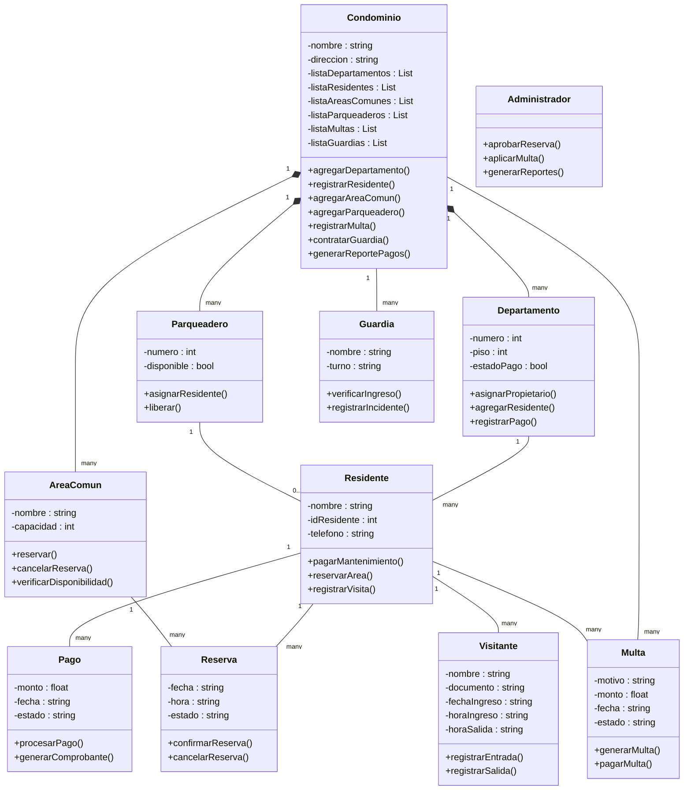

# RETO2

```mermaid
classDiagram

class Condominio {
    -nombre : string
    -direccion : string
    -listaDepartamentos : List
    -listaResidentes : List
    -listaAreasComunes : List
    -listaParqueaderos : List
    -listaMultas : List
    -listaGuardias : List
    +agregarDepartamento()
    +registrarResidente()
    +agregarAreaComun()
    +agregarParqueadero()
    +registrarMulta()
    +contratarGuardia()
    +generarReportePagos()
}

class Departamento {
    -numero : int
    -piso : int
    -estadoPago : bool
    +asignarPropietario()
    +agregarResidente()
    +registrarPago()
}

class Residente {
    -nombre : string
    -idResidente : int
    -telefono : string
    +pagarMantenimiento()
    +reservarArea()
    +registrarVisita()
}

class Administrador {
    +aprobarReserva()
    +aplicarMulta()
    +generarReportes()
}

class AreaComun {
    -nombre : string
    -capacidad : int
    +reservar()
    +cancelarReserva()
    +verificarDisponibilidad()
}

class Reserva {
    -fecha : string
    -hora : string
    -estado : string
    +confirmarReserva()
    +cancelarReserva()
}

class Pago {
    -monto : float
    -fecha : string
    -estado : string
    +procesarPago()
    +generarComprobante()
}

class Parqueadero {
    -numero : int
    -disponible : bool
    +asignarResidente()
    +liberar()
}

class Multa {
    -motivo : string
    -monto : float
    -fecha : string
    -estado : string
    +generarMulta()
    +pagarMulta()
}

class Visitante {
    -nombre : string
    -documento : string
    -fechaIngreso : string
    -horaIngreso : string
    -horaSalida : string
    +registrarEntrada()
    +registrarSalida()
}

class Guardia {
    -nombre : string
    -turno : string
    +verificarIngreso()
    +registrarIncidente()
}

Condominio "1" *-- "many" Departamento
Condominio "1" *-- "many" AreaComun
Condominio "1" *-- "many" Parqueadero
Condominio "1" -- "many" Multa
Condominio "1" -- "many" Guardia

Departamento "1" -- "many" Residente

Residente "1" -- "many" Pago
Residente "1" -- "many" Reserva
Residente "1" -- "many" Multa
Residente "1" -- "many" Visitante

AreaComun "1" -- "many" Reserva
Parqueadero "1" -- "0..1" Residente
```

Administrador --|> Residente
Guardia "1" -- "many" Visitante
