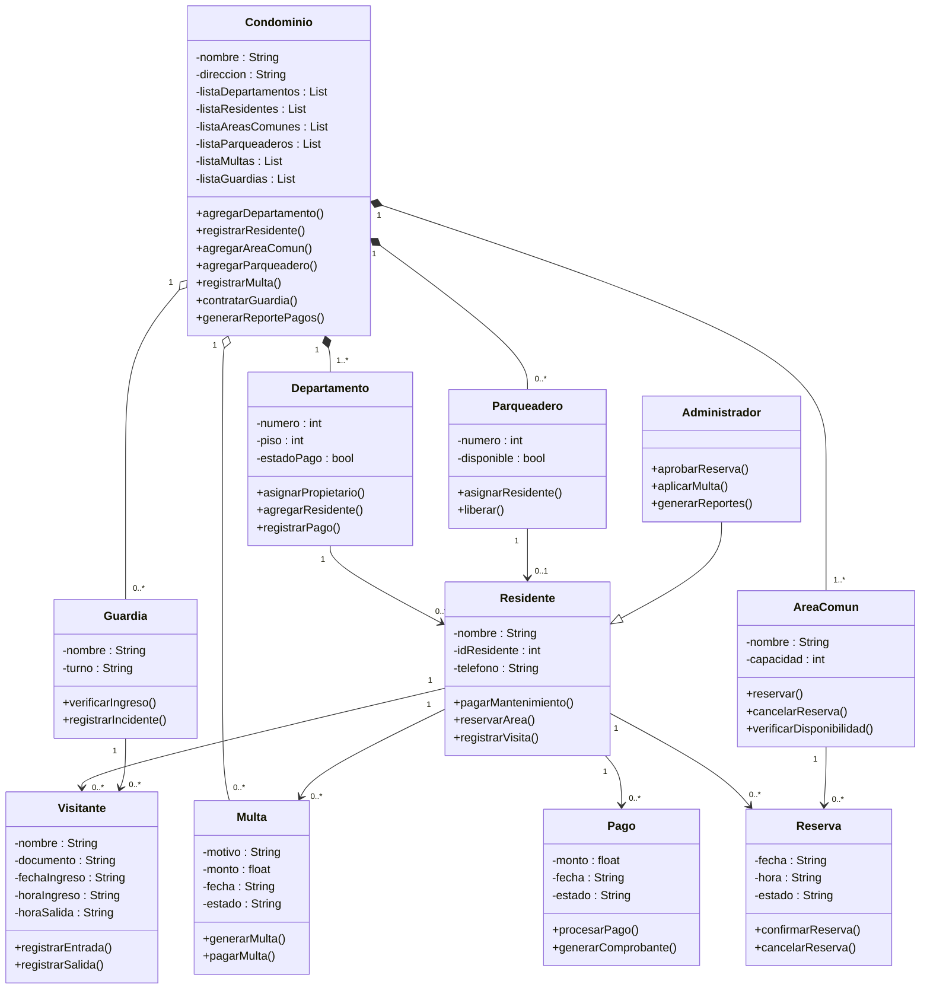

# RETO2

```mermaid
classDiagram
    direction TB

    class Condominio {
        -nombre : String
        -direccion : String
        -listaDepartamentos : List
        -listaResidentes : List
        -listaAreasComunes : List
        -listaParqueaderos : List
        -listaMultas : List
        -listaGuardias : List
        +agregarDepartamento()
        +registrarResidente()
        +agregarAreaComun()
        +agregarParqueadero()
        +registrarMulta()
        +contratarGuardia()
        +generarReportePagos()
    }

    class Departamento {
        -numero : int
        -piso : int
        -estadoPago : bool
        +asignarPropietario()
        +agregarResidente()
        +registrarPago()
    }

    class Residente {
        -nombre : String
        -idResidente : int
        -telefono : String
        +pagarMantenimiento()
        +reservarArea()
        +registrarVisita()
    }

    class Administrador {
        +aprobarReserva()
        +aplicarMulta()
        +generarReportes()
    }

    class AreaComun {
        -nombre : String
        -capacidad : int
        +reservar()
        +cancelarReserva()
        +verificarDisponibilidad()
    }

    class Reserva {
        -fecha : String
        -hora : String
        -estado : String
        +confirmarReserva()
        +cancelarReserva()
    }

    class Pago {
        -monto : float
        -fecha : String
        -estado : String
        +procesarPago()
        +generarComprobante()
    }

    class Parqueadero {
        -numero : int
        -disponible : bool
        +asignarResidente()
        +liberar()
    }

    class Multa {
        -motivo : String
        -monto : float
        -fecha : String
        -estado : String
        +generarMulta()
        +pagarMulta()
    }

    class Visitante {
        -nombre : String
        -documento : String
        -fechaIngreso : String
        -horaIngreso : String
        -horaSalida : String
        +registrarEntrada()
        +registrarSalida()
    }

    class Guardia {
        -nombre : String
        -turno : String
        +verificarIngreso()
        +registrarIncidente()
    }

    %% ================= RELACIONES =================

    %% Composición
    Condominio "1" *-- "1..*" Departamento
    Condominio "1" *-- "1..*" AreaComun
    Condominio "1" *-- "0..*" Parqueadero

    %% Agregación
    Condominio "1" o-- "0..*" Guardia
    Condominio "1" o-- "0..*" Multa

    %% Asociaciones
    Departamento "1" --> "0..*" Residente
    Residente "1" --> "0..*" Pago
    Residente "1" --> "0..*" Reserva
    Residente "1" --> "0..*" Multa
    Residente "1" --> "0..*" Visitante
    AreaComun "1" --> "0..*" Reserva
    Parqueadero "1" --> "0..1" Residente
    Guardia "1" --> "0..*" Visitante

    %% Herencia
    Administrador --|> Residente
```
