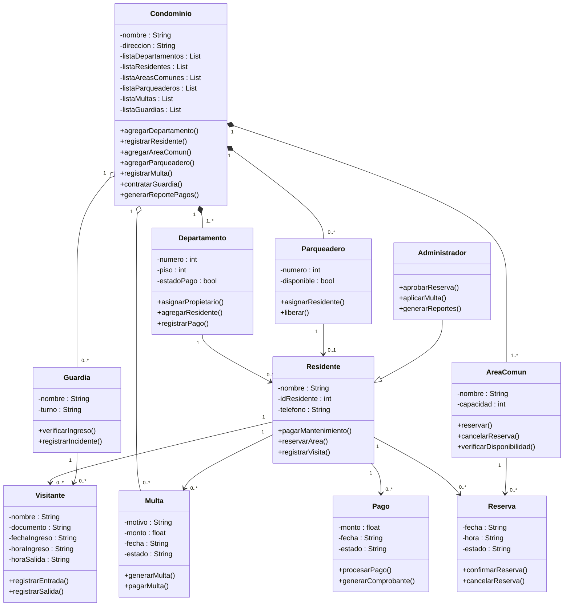

# RETO2

Mi diagrama de clases representa el sistema de gestión de un condominio y muestra básicamente cómo está estructurado el sistema, qué clases lo componen, qué atributos y métodos tiene cada una y cómo se relacionan entre sí. La clase principal es Condominio, ya que funciona como el núcleo del sistema. Esta clase contiene listas de departamentos, residentes, áreas comunes, parqueaderos, multas y guardias, lo que quiere decir que administra todos los elementos que conforman el conjunto residencial. Además, tiene métodos como agregar departamentos, registrar residentes, contratar guardias y generar reportes de pago. 

En cuanto a las relaciones, se utilizan multiplicidades como 0, 1 y *, que indican cuántas instancias de una clase pueden relacionarse con otra. El número 1 significa exactamente uno; 0 significa ninguno; y el símbolo * representa muchos. Cuando aparece 0..* significa que puede haber ninguno o muchos; 1..* indica que debe existir al menos uno; y 0..1 significa que puede haber ninguno o solamente uno. 

Por ejemplo, la relación entre Condominio y Departamento es de 1 a 1..*, lo que significa que un condominio debe tener al menos un departamento y puede tener muchos. En cambio, la relación entre Condominio y Parqueadero es 1 a 0..*, lo que indica que puede no tener parqueaderos o tener varios. 

El Departamento se relaciona con Residente en una multiplicidad de 1 a 0..*, lo que significa que un departamento puede estar vacío o tener varios residentes. Asimismo, un Residente puede tener múltiples pagos, reservas, multas y visitantes, representado con la multiplicidad 0..*, ya que no es obligatorio que tenga alguno de estos registros. 

El Parqueadero tiene una relación 0..1 con Residente, lo que indica que puede estar libre o asignado a un solo residente, pero nunca a más de uno al mismo tiempo. De igual forma, un Área Común puede tener múltiples reservas, y un Guardia puede registrar múltiples visitantes. 

Finalmente, el diagrama también muestra herencia entre Administrador y Residente, lo que significa que el Administrador es un tipo de Residente, pero con permisos adicionales como aprobar reservas, aplicar multas y generar reportes. 

Mi diagrama busca modelar la estructura del sistema del condominio, definiendo las responsabilidades de cada clase y estableciendo mediante las multiplicidades las reglas sobre cuántas instancias pueden relacionarse entre sí dentro del sistema.
